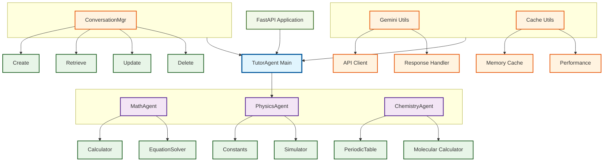

# TutorAgent - AI-Powered Educational Assistant

The AI Tutor is a modular multi-agent system for answering math, physics, and chemistry queries. Built using ADK principles, it uses a central Tutor Agent to coordinate sub-agents powered by tools and the Gemini API. It features a web interface, conversation history, and caching for performance.


## 🔗 Live Application

🚀 **[Access TutorAgent Live]()** 


## 📑 Table of Contents

- [Project Overview](#-project-overview)
- [What Makes TutorAgent Special?](#what-makes-tutoragent-special)
- [Architecture](#️-architecture)
- [Agent Interactions & Tools](#-agent-interactions--tools)
- [Running the Project Locally](#-running-the-project-locally)
- [Challenges & Solutions](#-challenges--solutions)
- [Contributing](#-contributing)

## 🎯 Project Overview

AI Tutor is a web-based platform that uses a multi-agent system to answer math, physics, and chemistry queries, powered by the Gemini API and ADK-inspired architecture.

### What Makes TutorAgent Special?

- **Intelligent Agent Routing**: Automatically directs queries to the most appropriate specialist agent
- **Contextual Conversations**: Maintains conversation history for coherent, personalized tutoring sessions
- **Advanced Computational Tools**: Integrates SymPy for symbolic mathematics and custom physics simulators
- **Real-time Simulations**: Provides interactive physics scenarios with visual explanations
- **Multi-user Support**: Handles multiple students with separate conversation contexts

## 🏗️ Architecture

TutorAgent uses a modular, multi-agent architecture that ensures scalability and maintainability:

- **Tutor Agent**: The main orchestrator that classifies user queries as math, physics, chemistry, or unknown using the Gemini API. It delegates queries to the appropriate sub-agent and maintains conversation history for context.

- **Math Agent**: Handles math queries (e.g., "Solve 2x + 5 = 11") using a calculator tool for arithmetic operations and Gemini API for explanations.

- **Physics Agent**: Processes physics queries (e.g., "What is the speed of light?") with a constants lookup tool and Gemini API for detailed responses.

- **Chemistry Agent**: Addresses chemistry queries (e.g., "What is the atomic number of carbon?") using a periodic table lookup tool and Gemini API.

- **Tools**:

    - **Calculator**: Performs basic arithmetic (e.g., "6 * 4").

    - **Constants Lookup**: Retrieves physical constants (e.g., speed of light).

    - **Periodic Table Lookup**: Provides element properties (e.g., atomic number of oxygen).

    - **Web Interface**: A simple HTML/CSS/JavaScript frontend served by FastAPI, allowing users to input queries and view responses.

    - **Context Management**: Stores query-response pairs to support follow-up questions (e.g., "Explain that again").

    - **Robustness**: Input validation, error handling, and caching (via lru_cache) ensure reliability and performance.


## 🤖 Agent Interactions & Tools

- **Interaction Flow**:
  1. The user submits a query via the web interface or `/ask` API endpoint.
  2. The **Tutor Agent** receives the query and uses the Gemini API to classify it as math, physics, chemistry, or unknown, considering conversation history for context.
  3. The Tutor Agent delegates the query to the appropriate sub-agent:
     - **Math Agent**: Processes arithmetic (using the calculator tool) or general math queries (using Gemini API).
     - **Physics Agent**: Retrieves constants (using the constants lookup tool) or answers general physics questions.
     - **Chemistry Agent**: Looks up element properties (using the periodic table tool) or provides chemistry explanations.
  4. Sub-agents combine tool outputs (if applicable) with Gemini-generated explanations and return responses to the Tutor Agent.
  5. The Tutor Agent stores the query and response in conversation history and returns the response to the user.
- **Tool Usage**:
  - **Calculator**: Parses arithmetic expressions (e.g., "6 * 4" → 24.0) for precise calculations.
  - **Constants Lookup**: Retrieves physical constants from `constants.json` (e.g., speed of light: 299792458 m/s).
  - **Periodic Table Lookup**: Retrieves element properties from `periodic_table.json` (e.g., carbon's atomic number: 6).
  - Tools are called when queries match specific patterns (e.g., arithmetic expressions, element names), ensuring accurate data integration with Gemini's natural language responses.


## 📋 Prerequisites

Before setting up TutorAgent locally, ensure you have:

- **Python 3.8 or higher**
- **pip** (Python package manager)
- **Git** (for cloning the repository)
- **Google Gemini API Key** (for AI functionality)

### Getting a Gemini API Key

1. Visit [Google AI Studio](https://aistudio.google.com/app/apikey)
2. Sign in with your Google account
3. Click "Create API Key"
4. Copy the generated API key (you'll need this for setup)

## 🚀 Local Setup

### 1. Clone the Repository

```bash
git clone https://github.com/rameshchandra8520/TutorAgent.git
cd TutorAgent
```

### 2. Create and Activate Virtual Environment

```bash
# Create virtual environment
python -m venv venv

# Activate virtual environment
# On Windows:
venv\Scripts\activate
# On macOS/Linux:
source venv/bin/activate
```

### 3. Install Dependencies

```bash
pip install -r requirements.txt
```

### 4. Environment Configuration

Create a `.env` file in the project root:

```bash
# Copy the example environment file
cp .env.example .env
```

Edit the `.env` file and add your configuration:

```env
# Required: Your Gemini API Key
GEMINI_API_KEY=your_actual_gemini_api_key_here  
```

## 🏃‍♂️ Running the Project Locally

### Development Server

Start the FastAPI development server:

```bash
uvicorn main.py:app --reload
```
- The server runs at http://localhost:8000.
- The --reload flag enables auto-restart on code changes.


### Access the Web Interface:


- Open a browser and navigate to http://localhost:8000/static/index.html.
- Enter queries like:
    - Math: "What is 6 * 4?" or "Solve 3x - 9 = 0"
    - Physics: "What is the speed of light?" or "Explain Newton's first law"
    - Chemistry: "What is the atomic number of carbon?" or "Explain the role of oxygen"
    - Follow-up: "Explain that again" (uses conversation history)

### Test the API

```bash
curl -X POST http://localhost:8000/ask -H "Content-Type: application/json" -d '{"query": "What is the atomic number of carbon?"}'
```

### API Endpoints

| Method | Endpoint | Description |
|--------|----------|-------------|
| POST | `/conversations` | Create new conversation |
| GET | `/conversations` | List all conversations |
| GET | `/conversations/{id}` | Get conversation history |
| DELETE | `/conversations/{id}` | Delete conversation |
| POST | `/ask` | Ask a question |

### Run Unit Tests

```bash
python test_calculator.py
python test_constants.py
python test_periodic_table.py
```


## 🛠️ Challenges & Solutions

### Challenge 1: Agent Coordination
**Problem**: Ensuring smooth communication between different specialized agents while maintaining conversation context.

**Solution**: Implemented a centralized TutorAgent that acts as an orchestrator, routing queries to appropriate agents while injecting conversation history. Used standardized interfaces for all agents to ensure consistent behavior.

### Challenge 2: Conversation State Management
**Problem**: Maintaining conversation context across multiple interactions while supporting multiple users simultaneously.

**Solution**: Developed a dedicated ConversationManager with in-memory storage and unique conversation IDs. Implemented proper isolation between user sessions.

### Challenge 3: API Rate Limiting
**Problem**: Managing Google Gemini API rate limits while providing responsive user experience.

**Solution**: Implemented intelligent caching strategies, optimized prompt engineering to reduce API calls, and added graceful error handling for rate limit scenarios.

### Challenge 4: Input Validation
**Problem**: Handling invalid or edge-case inputs that could disrupt the system or provide poor user experience.

**Solution**: Added client-side (JavaScript) and server-side (FastAPI) input validation for empty or overly long queries, with clear error messages.


## 🤝 Contributing

We welcome contributions! Please follow these steps:

To contribute: Clone the repository, make your changes, commit and push your code, then submit a pull request.


---

**Happy Learning with TutorAgent! 🎓**